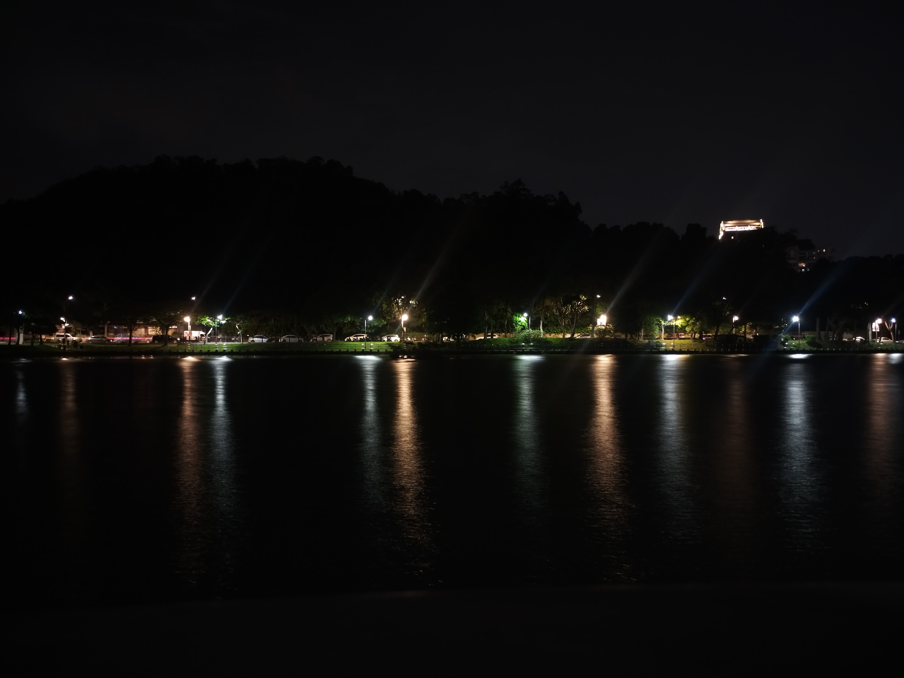
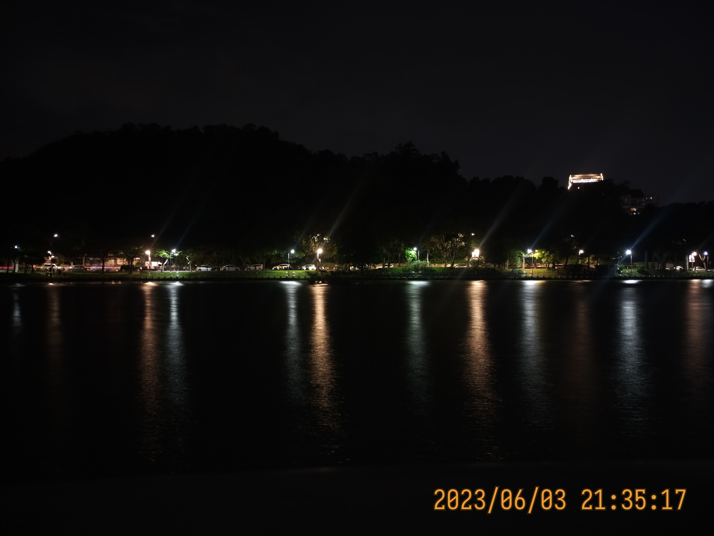
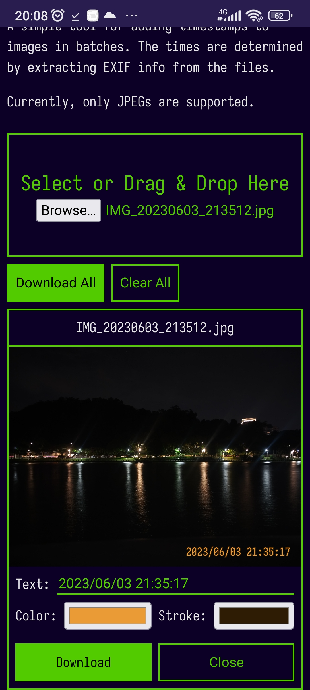

# Image Timestamper

A simple tool for adding timestamps to images in batches. The times are determined by extracting EXIF info from the files.

Currently, only JPEGs are supported.

# Demo
## Before vs. After
|           Original           |                Timestamped               |
| :--------------------------: | :--------------------------------------: |
|  |  |

## Screenshot

See? This also works on phones!
